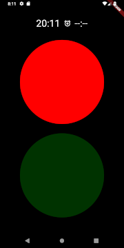
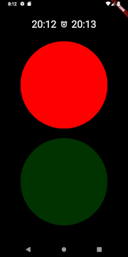
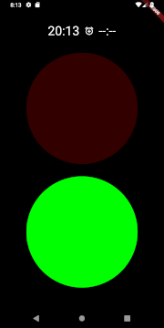

# Red Green Alarm

## What Is It?

Red Green Alarm is an alarm clock that works on the concept of "Light is Red, Stay in Bed."
The current time will be displayed with the red light illuminated; after an alarm time is set,
once the current time reaches the alarm time, the green light becomes illuminated to indicate
it is now allowable to get out of bed.

No Alarm                      |  Alarm Set                     | Post Alarm
:----------------------------:|:------------------------------:|:-------------------------------:
 |  | 
## Warning
This app keeps the device screen from shutting off. So, you have a big red circle and
a big green circle that are at the same spot on the screen for the duration of the sleep
period. It is completely unknown if this will cause screen burn and/or ghosting. This
software is provided as-is, and you use it at your own risk and the risk of the device
you choose to use it on.

## Background

My children each have a stoplight alarm clock in their rooms, that have the red light
illuminated until the set alarm time, at which point the green light turns on.
Whenever we travel, the children inevitably start creeping the time they get out of bed
earlier and earlier into the morning. Unfortunately, the stoplight alarm clocks they have
in their rooms are not a great size to pack into a bag for a trip, so I've created this app
to run on a tablet or phone more or less replicating the functionality of the clock.

## Use

### Store

I'm going to attempt to publish this to both Google Play and the App Store, so check
there first if you want to use this.

### Source

Otherwise, clone this repo, [install Flutter](https://flutter.io/get-started/install/),
and follow the [Android release](https://flutter.io/android-release/) instructions
to build the APK. You should be able to do the [iOS release](https://flutter.io/ios-release/)
steps, but I haven't yet tried it myself.
